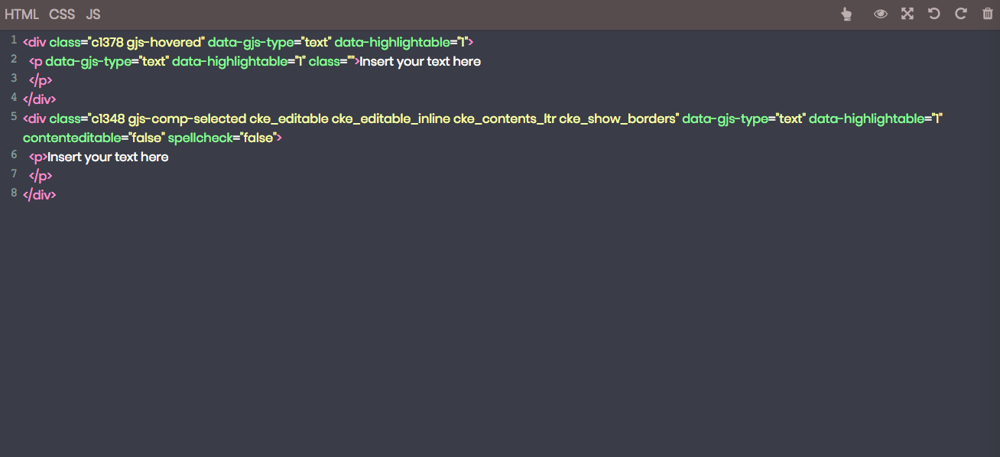

# grapesjs-editor
Grapesjs Editor

## About
This project was built using Grapes.js, Grapes.js plugins, Codemirror, Javascript, HTML and CSS.
As a template builder you can integrate to other JS Framework or ASP.NET.

[Demo](https://salty-dawn-15815.herokuapp.com/)